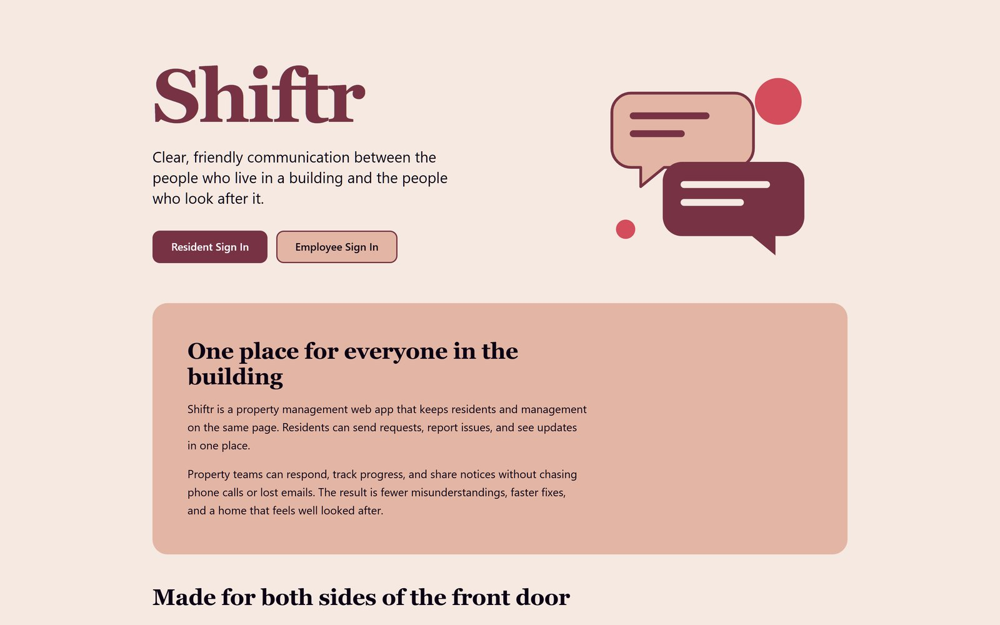
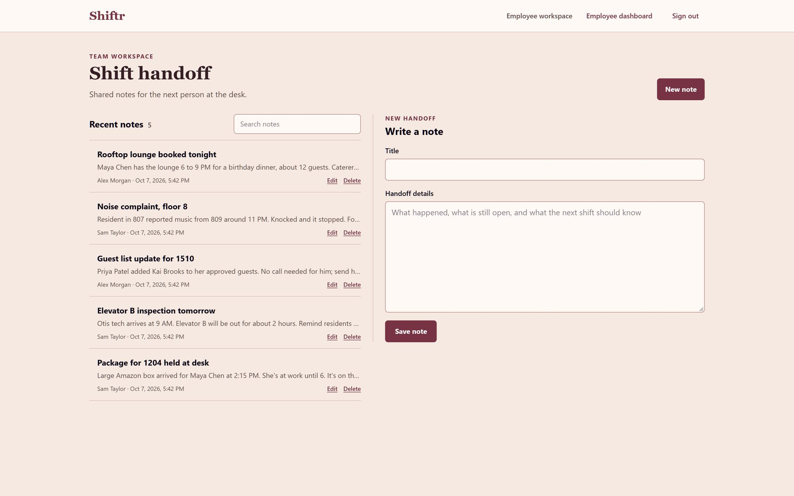
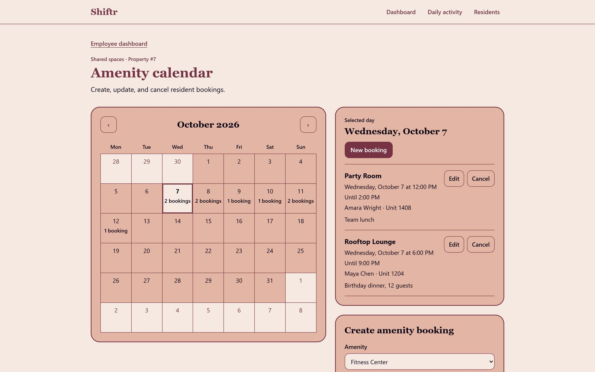
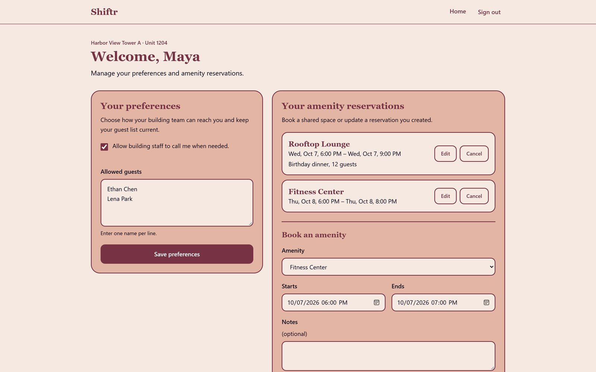
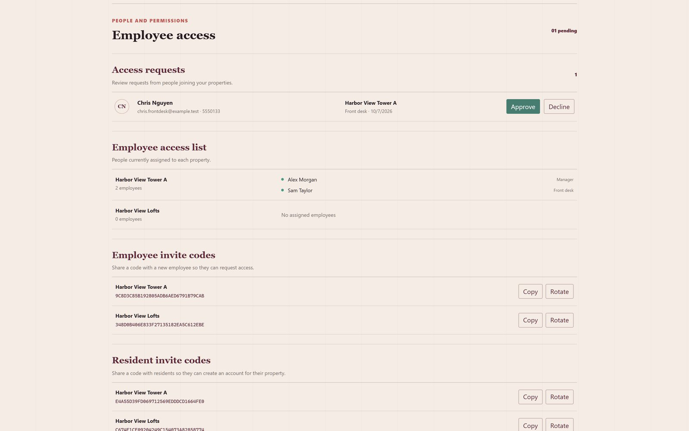
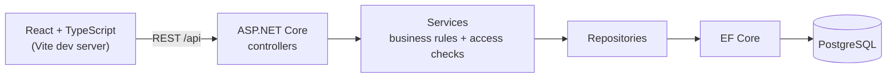

# Shiftr

[](https://github.com/Douty/Shiftr/actions/workflows/UnitTests.yml)
[](https://github.com/Douty/Shiftr/actions/workflows/UnitIntegration.yml)

**A property management web app that keeps front desk agents, residents, and management on the same page.**



## Why I built it

I work the front desk at an apartment building. Our desk ran three shifts (morning, night, and overnight), and handoffs happened out loud or on sticky notes. Details from one shift rarely made it to the next, so residents had to re-explain their issues to every new agent.

Shiftr replaces the sticky notes with one shared workspace. It was also my first .NET project.

## Features

**Front desk agents**
- Shared shift handoff notes for each property, with the author and time on every note
- A daily activity log for rounds, packages, incidents, and follow-ups
- Resident lookup by name or unit number
- An amenity calendar for creating, updating, and cancelling bookings; overlapping bookings are rejected

**Residents**
- Keep an approved guest list current
- Choose whether the desk may call them when visitors arrive
- Book the shared spaces their building offers

**Owners and managers**
- Create an organization and add properties
- Share separate employee and resident invite codes for each property
- Approve or decline staff access requests, which assigns the staff member's role
- See which employees are assigned to each property

## Screenshots

| Shift handoff | Amenity calendar |
| --- | --- |
|  |  |

| Resident dashboard | Owner workspace |
| --- | --- |
|  |  |

## Tech stack

| Layer | Technologies |
| --- | --- |
| Frontend | React 19, TypeScript, Tailwind CSS 4, Vite |
| Backend | ASP.NET Core on .NET 10, Entity Framework Core |
| Auth | ASP.NET Core Identity, role- and policy-based authorization |
| Database | PostgreSQL (Docker Compose for local development) |
| Testing | xUnit, Testcontainers for PostgreSQL |
| CI | GitHub Actions |

## Architecture



- **Controllers** handle HTTP, apply the role policy, and return status codes.
- **Services** hold business rules, such as rejecting overlapping amenity bookings and checking that a user may act on a specific record.
- **Repositories** wrap EF Core queries. Each layer is registered behind an interface for dependency injection.
- **Migrations** are applied automatically on startup, so the schema stays version-controlled.

## Security

Shiftr serves four roles: **Owner**, **Admin**, **Front Desk**, and **Resident**. Every endpoint is protected in two layers:

1. **A role policy on the endpoint**, such as `[Authorize(Policy = AuthorizationPolicies.AdminOnly)]`.
2. **A record-level check in the service layer**, such as `CanAccessEmployee` or `CanAccessAssignedProperty`, so users can only reach records in their own organization or property. This prevents insecure direct object references (IDOR).

New accounts get no access by default. Staff join with a property's employee invite code and stay pending until an owner or admin approves them. Residents join with the property's resident invite code, which links their account to the resident record.

## Testing

The suite has **85 tests** in one xUnit project, split by category:

| Category | Count | What it covers | Runs in CI |
| --- | --- | --- | --- |
| `Unit` | 61 | Controllers and services, with hand-written fakes for their dependencies | On every push and pull request |
| `Integration` | 24 | The full API against a real PostgreSQL database in Docker (Testcontainers), including cross-organization access rules | On pushes to `main` |

I kept both categories in one project and split them with test filters. The CI speed difference is small today, and a second project would add overhead. If the suite grows, the categories make it easy to move into two projects.

```bash
# Unit tests
dotnet test ShiftrTests/ShiftrTests.csproj --filter "Category=Unit"

# Integration tests (Docker must be running)
dotnet test ShiftrTests/ShiftrTests.csproj --filter "Category=Integration"
```

## Getting started

### Prerequisites

- [.NET 10 SDK](https://dotnet.microsoft.com/download)
- [Node.js](https://nodejs.org/) (current LTS)
- [Docker Desktop](https://www.docker.com/products/docker-desktop/)

### 1. Start PostgreSQL

Create a `.env` file in the repository root. It is git-ignored.

```env
POSTGRES_USER=shiftr
POSTGRES_PASSWORD=choose-a-local-password
POSTGRES_DB=shiftr
```

Then start the database. It listens on `127.0.0.1:5433`.

```bash
docker compose up -d
```

### 2. Configure the backend

Store the connection string in .NET user-secrets, using the values from your `.env` file:

```bash
dotnet user-secrets set "ConnectionStrings:DefaultConnection" "Host=127.0.0.1;Port=5433;Database=shiftr;Username=shiftr;Password=choose-a-local-password" --project backend/backend.csproj
```

### 3. Install and run

```bash
cd frontend
npm install
npm run start:both
```

This starts the Vite dev server at http://localhost:5173 and the API at http://localhost:5282. Vite proxies `/api` requests to the API. Database migrations run when the API starts.

### 4. Create your first account

Open http://localhost:5173, choose **Employee Sign In**, then **Create account**, and select **Create a new organization**. You become the organization's owner and can add properties and share invite codes.

### Optional: development owner and sample data

These settings only work in the Development environment. The API refuses to start if they are set anywhere else.

**Bootstrap owner.** Creates an Owner account on startup, or promotes an existing account without changing its password:

```bash
dotnet user-secrets set "BootstrapOwner:Email" "you@example.com" --project backend/backend.csproj
dotnet user-secrets set "BootstrapOwner:Password" "choose-a-strong-local-password" --project backend/backend.csproj
```

**Sample data.** Fills every organization with at least 150 residents and 30 employees, plus properties, amenities, reservations, shift notes, and pending or rejected access requests. Sample accounts use the `@example.test` domain and share this password. The seeder is idempotent.

```bash
dotnet user-secrets set "DevelopmentData:Password" "choose-a-strong-local-password" --project backend/backend.csproj
```

Remove either setting with `dotnet user-secrets remove "<key>" --project backend/backend.csproj`.

## Project structure

```
Shiftr/
├── backend/            ASP.NET Core API
│   ├── Controllers/    HTTP endpoints and role policies
│   ├── Services/       Business rules and record-level access checks
│   ├── Repositories/   EF Core data access
│   ├── Models/ DTOs/   Entities and request/response shapes
│   ├── Data/           DbContext and migrations
│   ├── Middleware/     Invite code validation on registration
│   └── Security/       Role and policy names
├── frontend/           React + TypeScript app (Vite)
│   └── src/components/ Landing, Auth, Employee, Resident, Organization pages
├── ShiftrTests/        xUnit unit and integration tests
├── docs/screenshots/   Images used in this README
└── docker-compose.yml  Local PostgreSQL
```

## Roadmap

- Pilot Shiftr at my apartment building
- Run access checks before existence checks, so missing and forbidden IDs return the same response
- Add a fallback policy that requires authentication on every new endpoint by default
- Alert agents to urgent handoff notes

## Author

Built by **Douty Manigat**: [LinkedIn](https://linkedin.com/in/doutymanigat/) · [doutymanigat@gmail.com](mailto:doutymanigat@gmail.com)
